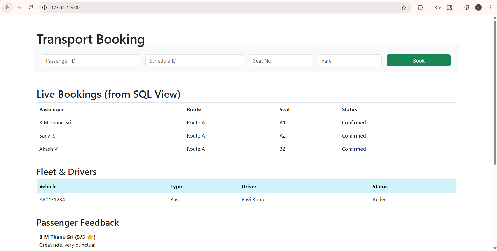

# Public Transportation Optimization System
A web-based dashboard for managing urban transit.

## Tech Stack
- **Frontend:** HTML5, Bootstrap 5
- **Backend:** Python (Flask)
- **Database:** MySQL (Triggers, Stored Procedures, Views)

## How to Setup
1. Import `schema.sql` into your MySQL Workbench.
2. Install dependencies: `pip install -r requirements.txt`.
3. Update `app.py` with your MySQL password.
4. Run the app: `python app.py`.
